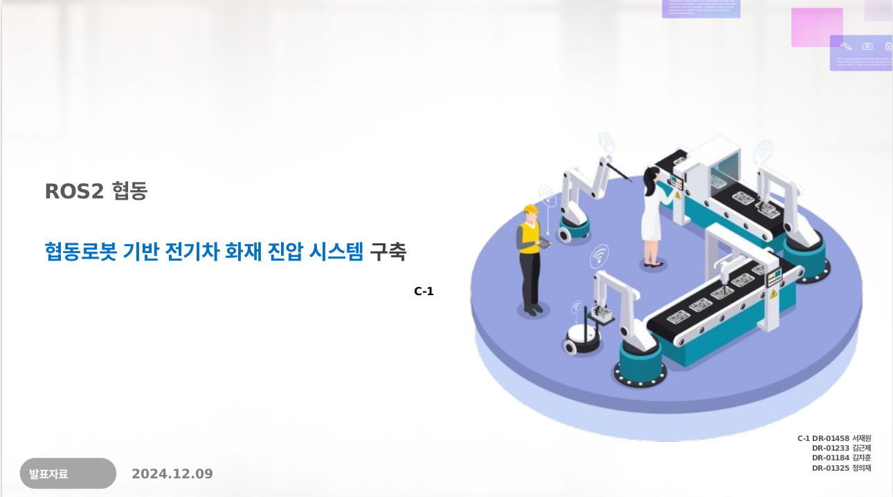
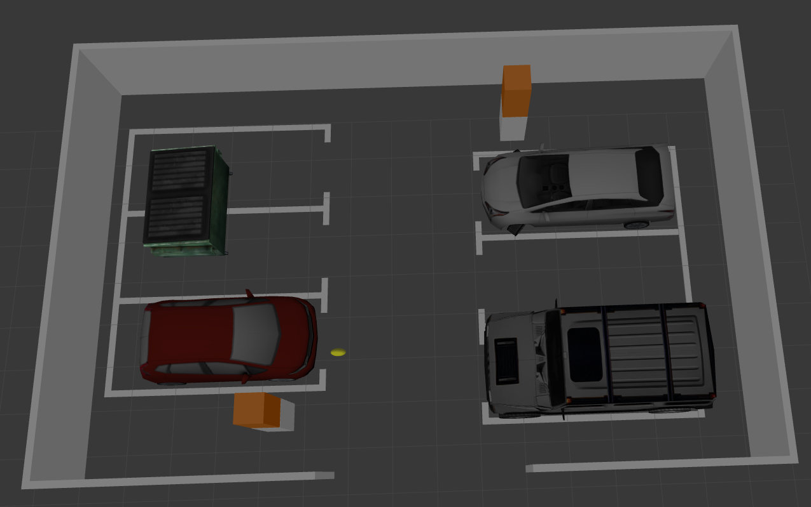

# 🚒 3주차: ROS2 기반 협동 로봇 전기차 화재 진압 시스템

본 프로젝트는 **ROS2를 활용하여 협동 로봇을 이용한 전기차 화재 진압 시스템을 구축**하는 것을 목표로 합니다.

## 📜 발표 자료  

## 📌 프로젝트 개요
- **프로젝트명**: ROS2 기반 협동 로봇 전기차 화재 진압 시스템
- **발표일**: 2024.12.09
- **팀명**: C-1조
- **팀원**: 서재원, 김근제, 김차훈, 정의재

## 🎯 프로젝트 목표
- **전기차 화재 감지 및 신속한 대응 시스템 구축**
- **ROS2를 활용한 실시간 데이터 공유 및 자동화 시스템 구현**
- **협동 로봇을 통한 화재 진압 및 관제 시스템 연동**

## ⚙️ 시스템 개요
### ✅ 주요 기능
- **탐지 로봇을 통한 화재 감지 및 좌표 전송**
- **화재 진압 로봇을 활용한 자동화 소방 시스템**
- **관제 시스템을 통한 실시간 모니터링 및 명령 제어**

### 📊 사용한 ROS2 기능
| No. | 기능명 | 설명 |
|----|---------|--------------------------------------------------|
| 1  | `detect_fire` | 화재 감지 및 위치 데이터 전송 |
| 2  | `send_coordinates` | 탐지된 화재의 좌표를 ROS2 토픽으로 전송 |
| 3  | `monitoring_system` | 관제 시스템에서 실시간 화재 감시 |
| 4  | `send_fire_command` | 진압 로봇에 화재 진압 명령 전달 |
| 5  | `deploy_fire_robot` | 화재 진압 로봇 출동 |
| 6  | `execute_fire_suppression` | 진압 로봇이 자동으로 화재를 진압 |
| 7  | `lidar_scan` | LiDAR를 활용한 화재 위치 분석 |
| 8  | `camera_stream` | 카메라를 이용한 실시간 영상 전송 |
| 9  | `alert_signal` | 화재 발생 시 경고 알람 송출 |
| 10 | `display_dashboard` | 관제 시스템 대시보드에 상황 표시 |

## 🏗️ 프로젝트 시나리오
### 1️⃣ 화재 발생 감지 및 대응
1. 탐지 로봇이 화재 감지 후 좌표를 관제 시스템으로 전송
2. 관제 시스템이 화재 감지 후 진압 로봇에 명령 전달
3. 화재 진압 로봇이 현장으로 이동하여 화재 진압 실행
4. 진압 완료 후 관제 시스템에 결과 보고

## 🔥 프로젝트 결과
### 📌 주요 코드 리뷰
#### 🏗️ 화재 감지 코드
- LiDAR 및 카메라를 이용한 **화재 감지 알고리즘**
- 감지된 화재 정보를 **ROS2 토픽을 통해 관제 시스템으로 전송**

#### 🏗️ 로봇 이동 및 화재 진압 코드
- 진압 로봇이 **탐지된 화재 좌표로 이동**
- EV-Drill Lance를 활용한 화재 진압 동작 수행

#### 🏗️ 관제 시스템 통합 코드
- 대시보드를 통해 로봇 및 화재 상황을 실시간으로 모니터링
- 화재 발생 시 즉각적인 경고 알람 송출

### 🏆 실습 결과물
<table>
  <tr>
    <td align="center">
      
       <b>World</b> 
    </td>
  </tr>
</table>
